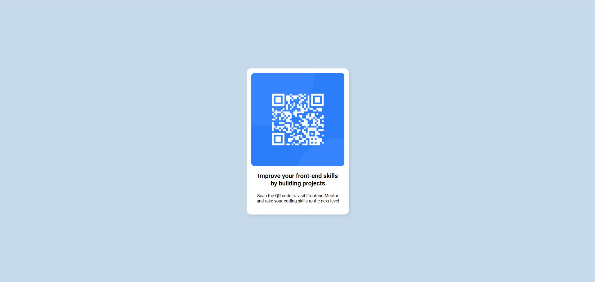

# Frontend Mentor - QR code component solution

This is a solution to the [QR code component challenge on Frontend Mentor](https://www.frontendmentor.io/challenges/qr-code-component-iux_sIO_H). Frontend Mentor challenges help you improve your coding skills by building realistic projects. 

## Table of contents

- [Overview](#overview)
  - [Screenshot](#screenshot)
  - [Links](#links)
- [My process](#my-process)
  - [Built with](#built-with)
  - [What I learned](#what-i-learned)
  - [Continued development](#continued-development)
  - [Useful resources](#useful-resources)
- [Author](#author)

## Overview

### Screenshot



### Links

- Solution URL: [View solution](https://github.com/srini255/qr-code-component)

## My process

### Built with

- Semantic HTML5 markup
- CSS custom properties
- Flexbox
- Mobile-first workflow

### What I learned

I learned how to structure a simple component using semantic HTML and style it effectively with CSS. Here's an example of the CSS I used for centering the component:

```css
.container {
  display: flex;
  justify-content: center;
  align-items: center;
  height: 100vh;
}
```

### Continued development

I want to continue improving my CSS skills, particularly with responsive design and advanced layout techniques like CSS Grid.

### Useful resources

- [CSS Tricks - A Complete Guide to Flexbox](https://css-tricks.com/snippets/css/a-guide-to-flexbox/) - This guide helped me understand how to use Flexbox for layout.
- [MDN Web Docs - HTML](https://developer.mozilla.org/en-US/docs/Web/HTML) - A great reference for semantic HTML.

## Author

- Frontend Mentor - [Srinivash](https://www.frontendmentor.io/profile/Srini255)
- GitHub - [srini255](https://github.com/srini255)